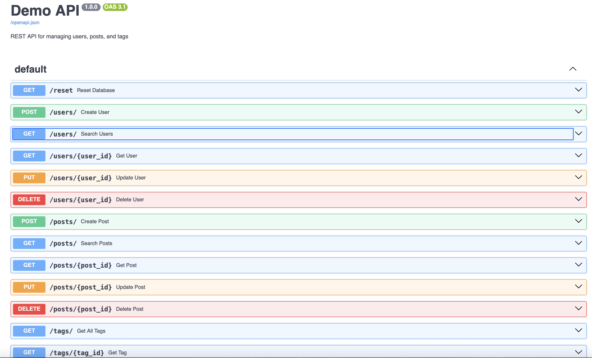
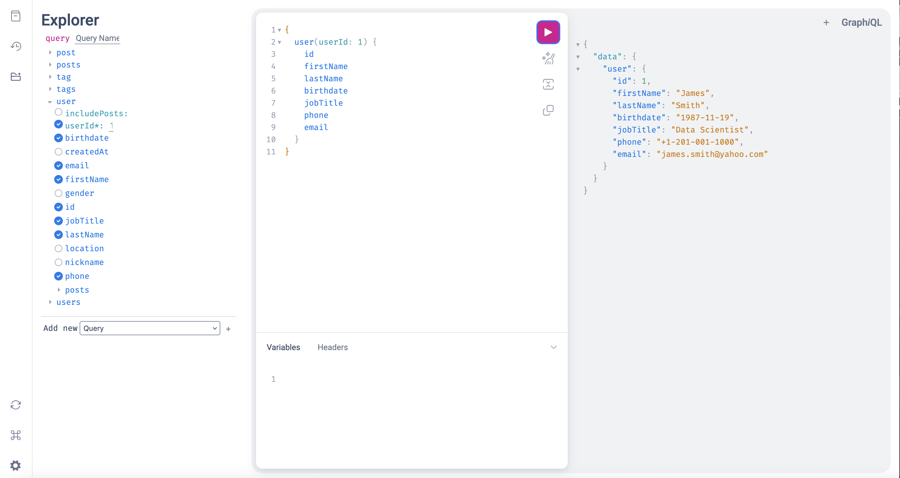
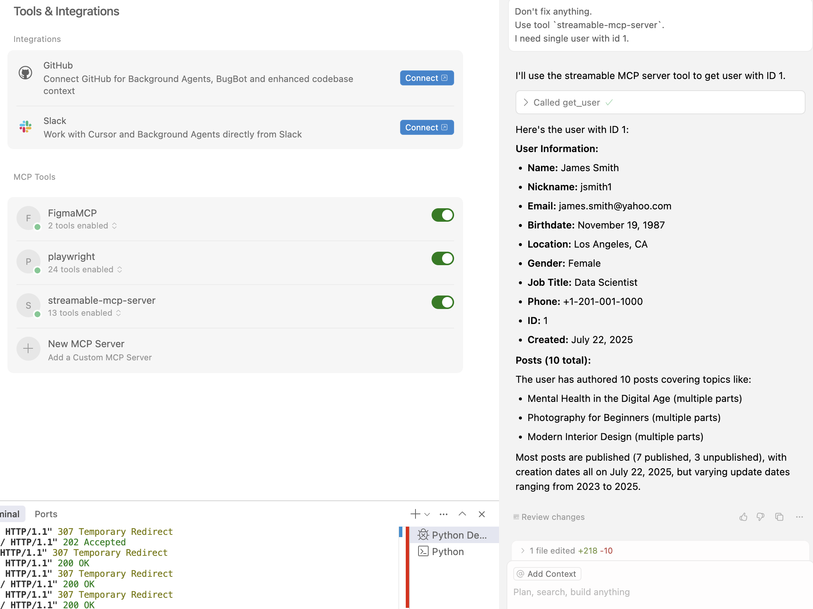
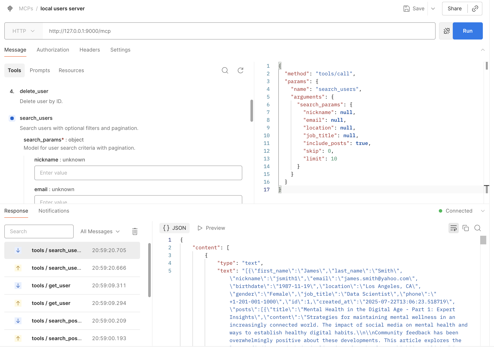

# 🧪 Demo API Service (FastAPI + GraphQL + MCP)

A demonstration project showcasing a modular REST API built with **FastAPI**, featuring an auxiliary **MCP server** for AI integrations and a relational **PostgreSQL** database schema.

Designed for showcasing backend architecture, clean code structure, and integration between classic APIs and AI-oriented microservices.

---

## 🚀 Features

### Python Stack
- ⚡ FastAPI-based REST endpoints (`api_service.py`)
- 🔄 GraphQL API with Strawberry GraphQL (`graphql_service.py`)
- 🤖 Lightweight MCP server for AI/ML integration (`mcp_service.py`)
- 🧱 SQLAlchemy 2.0 ORM models
- 🔐 Pydantic models for data validation
- 🧪 Minimal test runner (`testing.py`)

### Node.js Stack
- 🟢 NestJS REST API with Swagger documentation (`Nest/`)
- 🔄 GraphQL API with Apollo Server
- 🧱 TypeORM entities
- 🔐 class-validator DTOs

### Shared
- 🗄 PostgreSQL database schema with users, posts, tags, post-tag relations

---

## 🖼 Demo Screenshots

### FastAPI OpenAPI Documentation



### GraphQL Explorer Interface



### CursorAI integration with MCP server



### MCP Server usage via Postman



---

## 📁 Project Structure

```text
demo-api-test/
├── Nest/                    # NestJS implementation
│   ├── src/
│   │   ├── config/          # Database configuration
│   │   ├── entities/        # TypeORM entities
│   │   ├── modules/         # Feature modules (users, posts, tags, graphql)
│   │   ├── app.module.ts    # Root module
│   │   └── main.ts          # Entry point
│   └── package.json
├── Tools/
│   ├── __init__.py          # Declares as package
│   ├── config.py            # Constants & DB config
│   ├── db.py                # DB access logic (CRUD)
│   ├── models.py            # SQLAlchemy ORM models
│   ├── schemas.py           # Pydantic models
│   └── testing.py           # Simple test script
├── api_service.py           # Main REST API service
├── graphql_service.py       # GraphQL API service (Strawberry + FastAPI)
├── mcp_service.py           # AI/MCP integration server
├── SQL/
│   ├── schema.sql           # PostgreSQL schema (users, posts, tags)
│   └── dummy_data.sql       # Sample data
```

---

## 🛠 Setup

### 1. Clone the repository

```bash
git clone https://github.com/genry86/demo-api-test
cd demo-api-test
```

### 2. Install and start PostgreSQL

PostgreSQL must be installed and running before proceeding. Install it using your system's package manager (e.g., `brew install postgresql` on macOS, `apt install postgresql` on Ubuntu).

### 3. Set up the database

- Create a database named `DemoApiTest` (or update `.env` with your database name)
- Run the schema and sample data scripts:

```bash
psql -U postgres -d DemoApiTest -f SQL/schema.sql
psql -U postgres -d DemoApiTest -f SQL/dummy_data.sql
```

- Update `.env` file with your database credentials if different from defaults

### 4. Install dependencies

```bash
pip install -r requirements.txt
```

(*Note: Create `requirements.txt` if missing using `pip freeze > requirements.txt`*)

### 5. Run the services

#### Python Services

```bash
# Run REST API service (port 8000)
python api_service.py

# Run GraphQL API service (port 8001)
python graphql_service.py

# Run MCP server (optional AI interface, port 9000)
python mcp_service.py
```

#### NestJS Service

```bash
cd Nest

# Install dependencies
npm install

# Run in development mode (port 8000)
npm run start:dev

# Or build and run production
npm run build
npm run start
```

---

## 🎯 API Overview

Once running, access:

**Python Services:**
- REST API Docs: [http://localhost:8000/docs](http://localhost:8000/docs)
- GraphQL Playground: [http://localhost:8001/graphql](http://localhost:8001/graphql)
- MCP API Docs: [http://localhost:9000/docs](http://localhost:9000/docs)

**NestJS Service:**
- Swagger Docs: [http://localhost:8000/docs](http://localhost:8000/docs)
- GraphQL Playground: [http://localhost:8000/graphql](http://localhost:8000/graphql)

### GraphQL API Features

The GraphQL service uses **Strawberry GraphQL** in combination with **FastAPI** to provide:

- **Queries**: `user`, `users`, `post`, `posts`, `tag`, `tags` (equivalent to GET operations)
- **Mutations**: `createUser`, `updateUser`, `deleteUser`, `createPost`, `updatePost`, `deletePost`, `resetDatabase` (equivalent to POST/PUT/DELETE operations)
- **Type-safe GraphQL schema** with full relationship support
- **Interactive GraphQL Explorer** for testing queries and mutations

---

## 🧪 Testing

Quick test runner is available via:

```bash
python Tools/testing.py
```

You can customize test routines as needed.

---

## 🧠 Notes

- All modules under `Tools/` are part of a Python package (`__init__.py` is present).
- Imports follow absolute module structure (e.g., `from Tools.db import DatabaseManager`)
- SQLAlchemy relationships are `lazy="select"` to avoid unnecessary joins.
- Relationships like `posts` are loaded only when explicitly requested via `.options(selectinload(...))`.

---

## 🔗 Repository

GitHub: [https://github.com/genry86/demo-api-test](https://github.com/genry86/demo-api-test)
